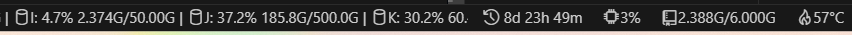

# Monitor Ultra

[English](./README.md) | 简体中文

Monitor Ultra 是一个全面的资源监控工具，专为Ubuntu Linux系统增强了GPU监控功能。基于原始的Monitor Pro项目，但包含了显著的改进和新功能。无论你是什么职业，如果你用VS Code，请不要错过它。

## 🚀 Monitor Ultra的新特性

### 增强的GPU监控

- **Ubuntu优化**：专门针对Ubuntu Linux系统的特别优化
- **NVIDIA GPU支持**：完整的GPU利用率、内存和温度监控
- **智能错误处理**：智能错误检测和优雅降级
- **性能缓存**：通过智能缓存机制减少系统调用

### 改进的用户体验

- **自动检测**：自动检测和配置GPU监控
- **灵活配置**：对监控功能的精细控制
- **多语言支持**：增强的中文、日文和英文本地化
- **完整文档**：为Ubuntu用户提供详细的设置指南

## 屏幕截图

## 功能特点

- [ ] **资源监控**
  - [X] **CPU 使用率**：监控 CPU 利用率的百分比，以了解系统正在利用多少处理能力。
  - [X] **CPU 频率**：跟踪当前 CPU 频率，以了解系统如何动态调整其处理能力。
  - [X] **CPU 温度**：（如果可以的话）监控温度。
  - [X] **内存使用**：关注计算机的内存消耗情况。
  - [X] **网络使用**：跟踪机器上的网络活动，包括传入和传出的数据传输速率。
  - [X] **文件系统使用**（Linux、macOS）：提供磁盘的读写速率。
  - [X] **电池百分比和充电状态**：如果你使用的是笔记本电脑或便携设备，此功能可让你监控电池电量和充电状态。
  - [X] **操作系统发行版名称**
  - [X] **GPU 监控**：监控 NVIDIA GPU 的利用率、内存使用和温度（需要 nvidia-smi 工具，已优化Ubuntu支持）
  - [X] **磁盘使用**
- [X] **排序**：自定义监控资源的显示顺序，方便一目了然地监控它们。
- [X] **刷新间隔**：设置更新资源指标的刷新间隔。
- [X] **无布局移位**：确保状态栏中元素的位置和大小不会意外改变。
- [X] **远程 SSH 资源监控**: 无缝支持监控通过 VS Code Remote SSH 连接的远程服务器资源。
- [ ] **高占用率警报**：当任何监控的资源达到高占用水平时，接收警报。
- [ ] **仪表板**：我希望在一个页面上显示你关心的所有信息，并配备丰富的图表。

## 愿景

我深知监控信息的重要性，所以我的目标是打造一个最全面、最直观的监控工具，让你轻松掌握系统状态。开发 Monitor Ultra 的初衷是为了满足大家对系统监控的各种需求。

同时在未来我也希望集成图表的设计，让这些数据更加直观易懂。你可以通过这些图表清楚地看到系统各项指标的变化趋势和相互关系。这样，你就能轻松地了解系统的性能表现。并能够基于这些指标做出明智的决策。

## 灵感来源

- [https://github.com/nexmoe/vscode-monitor-pro](https://github.com/nexmoe/vscode-monitor-pro)（修改自该项目）
- [https://github.com/chneau/vscode-resource-monitor](https://github.com/chneau/vscode-resource-monitor)
- [https://github.com/Njanderson/resmon](https://github.com/Njanderson/resmon)

## 为什么要开发这款插件？

为了在使用 VS Code 的 Remote SSH 时提供一种全面的资源监控工具，以便更好地管理和监控服务器的状态。

详细参考：[https://juejin.cn/post/7284885060338155539](https://juejin.cn/post/7284885060338155539)

## 建议反馈

我非常重视用户的反馈和意见，因为它们对于我改进和完善产品至关重要。有好的建议或者遇到了 BUG，请前来反馈：

[https://github.com/nexmoe/vscode-monitor-ultra/issues](https://github.com/nexmoe/vscode-monitor-ultra/issues)

## 支持我

来 [Github](https://github.com/nexmoe/vscode-monitor-ultra) 点个 star 
